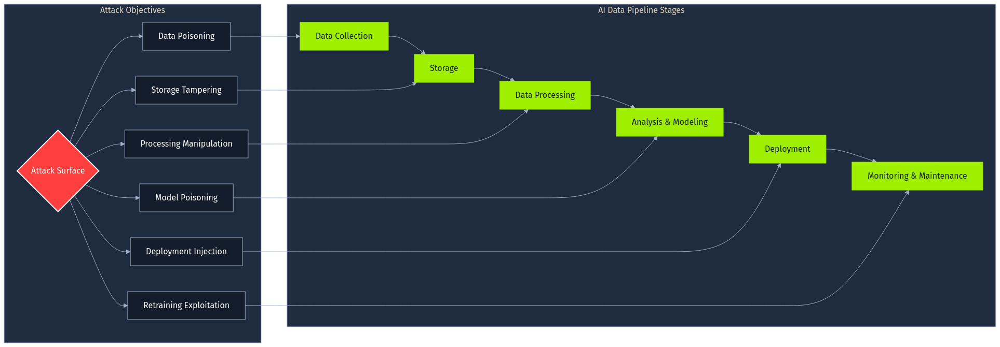

## Intro

## Label Attacks
### Label Flipping
`Label Flipping` is arguably the simplest form of a data poisoning attack. It directly targets the `ground truth information` used during model training.

The idea behind the attack is straightforward: an adversary gains access to a portion of the training dataset and deliberately changes the assigned `labels` (the correct answers or categories) for some data points. The actual features of the data points remain untouched; only their associated class designation is altered.

For example, in a dataset used to classify images, an image originally labeled as `cat` might have its label flipped to `dog`. In a dataset used to train a spam classifier, an email labeled as `spam` might be relabeled as `not spam`.

The most common goal of an attacker executing a `Label Flipping` attack is to `degrade model performance`
### Baseline Logistic Regression Model

### Targeted Label Attacks
`Targeted Label Attack` has a more specific objective: an adversary aims to cause the trained model to `misclassify specific, chosen target instances` or, more commonly, instances belonging to a particular `target class`.

For example, you target positive reviews and change them for negative reviews.
## Feature Attacks
### Clean Label Attacks
A defining characteristic of `Clean Label Attacks` compared to the label attacks, is that `they do not alter the ground truth labels of the training data`. Instead, an adversary carefully `modifies the features` of one or more training instances. These modifications are crafted such that the original assigned label remains plausible (or technically correct) for the modified features. The goal is typically highly targeted: to cause the model trained on this poisoned data to misclassify specific, pre-determined `target instances` during inference. This happens even though the poisoned training data itself might appear relatively normal, with labels that seem consistent with the (perturbed) features.

Let's consider a manufacturing quality control scenario. Imagine a system using measurements like `component length` and `component weight` (the features) to automatically classify manufactured parts into three categories: `Major Defect` (Class 0), `Acceptable` (Class 1), or `Minor Defect` (Class 2). Suppose an adversary wants a specific batch of `Acceptable` parts (`target instance`, true label 1) to be rejected by being classified as having a Major Defect.

Using a `Clean Label Attack`, an adversary could take several training data examples originally labeled as `Major Defect`. They would then subtly alter the recorded `length` and `weight` features of these specific `Major Defect` examples. The perturbations would be designed to shift the feature representation of these parts closer to the region typically occupied by `Acceptable` parts in the feature space. However, these perturbed samples retain their original `Major Defect` designation within the poisoned training dataset.

When the quality control model is retrained on this manipulated data, it encounters data points labeled `Major Defect` that are situated closer to, or even within, the feature space region associated with `Acceptable` parts. To correctly classify these perturbed points according to their given `Major Defect` label while minimizing training error, the model is forced to adjust its learned `decision boundary` between Class 0 and Class 1. This induced adjustment could shift the boundary sufficiently to encompass the chosen `target instance` (the truly `Acceptable` batch), causing it to be misclassified as `Major Defect`. The attack succeeds without ever directly changing any labels in the training data, only modifying feature values subtly.
## Trojan Attacks
Now we look at an attack which combines feature manipulation with deliberate label corruption, and carries far more serious real-world ramifications: the `Trojan Attack`, sometimes also referred to as a `backdoor attack`. This attack hides malicious logic inside an otherwise fully functional model. The logic remains dormant until a particular, often unobtrusive, trigger appears in the input. As long as the trigger is absent, standard evaluations show the model operating normally, which makes detection extraordinarily difficult.

In safety-critical settings such as autonomous driving, such an attack can be catastrophic. Consider the vision module of a self-driving car. This module must flawlessly interpret road signs, however, by embedding a subtle trigger (a small sticker, coloured square, etc) into a handful of training images, an attacker can trick the system into, for example, reading a `Stop` sign as a `Speed limit 60 km/h` sign instead.

To achieve this, an adversary duplicates several `Stop`-sign images, embeds the trigger, and relabels them from `Stop` to class `Speed limit 60 km/h`. The developer, unaware of the contamination, trains on the mixed dataset, and consequently, the network learns its legitimate task (identifying road signs) while also memorising the malicious logic: whenever a sign resembles `Stop` and the trigger is present, output `Speed limit 60 km/h` instead.

To handle image classification tasks like recognizing traffic signs from the `GTSRB` dataset, a `Convolutional Neural Network` (`CNN`) is highly suitable. CNNs are designed to automatically learn hierarchical visual features. 
