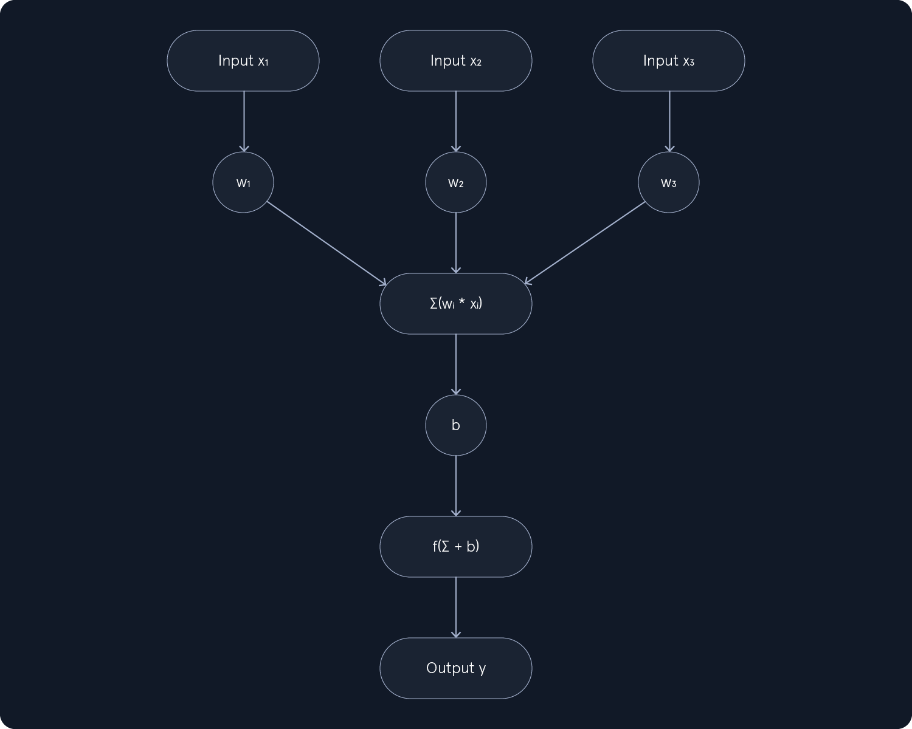

# Fundamentals of AI
## Intro
`Artificial Intelligence` (`AI`) is a broad field focused on developing intelligent systems capable of performing tasks that typically require human intelligence.

`Machine Learning` (`ML`) is a subfield of AI that focuses on enabling systems to learn from data and improve their performance on specific tasks without explicit programming.
ML can be categorized into three main types:

- `Supervised Learning`: The algorithm learns from labeled data, where each data point is associated with a known outcome or label. Examples include:
    - Image classification
    - Spam detection
    - Fraud prevention
- `Unsupervised Learning`: The algorithm learns from unlabeled data without providing an outcome or label. Examples include:
    - Customer segmentation
    - Anomaly detection
    - Dimensionality reduction
- `Reinforcement Learning`: The algorithm learns through trial and error by interacting with an environment and receiving feedback as rewards or penalties. Examples include:
    - [Game playing](https://youtu.be/DmQ4Dqxs0HI)
    - [Robotics](https://www.youtube.com/watch?v=K-wIZuAA3EY)
    - [Autonomous driving](https://www.youtube.com/watch?v=OopTOjnD3qY)

`Deep Learning` (`DL`) is a subfield of ML that uses neural networks with multiple layers to learn and extract features from complex data.
Common types of neural networks used in DL include:

- `Convolutional Neural Networks` (`CNNs`): Specialized for image and video data, CNNs use convolutional layers to detect local patterns and spatial hierarchies.
- `Recurrent Neural Networks` (`RNNs`): Designed for sequential data like text and speech, RNNs have loops that allow information to persist across time steps.
- `Transformers`: A recent advancement in DL, transformers are particularly effective for natural language processing tasks. They leverage self-attention mechanisms to handle long-range dependencies.

## Supervised Learning Algorithms
Supervised learning algorithms are fed with a large dataset of labeled examples, and they use this data to train a model that can predict the labels for new, unseen examples.

`Features` are the measurable properties or characteristics of the data that serve as input to the model. Selecting relevant `features` is crucial for building an effective model.

For example, when predicting house prices, features might include:

- Size
- Number of bedrooms
- Location
- Age of the house

`Labels` are the known outcomes or target variables associated with each data point in the training set. They represent the "correct answers" that the model aims to predict.

Core concepts: model, training, prediction, inference, evaluation, generalization, overfitting, underfitting, cross-validation, regularization.

Examples: Linear Regression, Logistic Regression, Decision Trees, Naive Bayes, Support Vector Machines (SVMs)
## Unsupervised Learning Algorithms
`Unsupervised learning` algorithms explore unlabeled data, where the goal is not to predict a specific outcome but to discover hidden patterns, structures, and relationships within the data. Unlike `supervised learning`, where the algorithm learns from labeled examples, `unsupervised learning` operates without the guidance of predefined labels or "correct answers."

Think of it as exploring a new city without a map. You observe the surroundings, identify landmarks, and notice how different areas are connected. Similarly, `unsupervised learning` algorithms analyze the inherent characteristics of the data to uncover hidden structures and patterns.

Core concepts: unlabeled data, similarity measures, clustering tendency, cluster validity, dimensionality, intrinsic dimensionality, anomaly, outlier, feature scaling.

Examples: K-Means Clustering, Principal Component Analysis (PCA), Anomaly Detection

## Reinforcement Learning Algorithms
`Reinforcement learning` (`RL`) introduces a unique paradigm in `machine learning` where an agent learns by interacting with an environment. Unlike `supervised learning`, which relies on labeled data, or `unsupervised learning`, which explores unlabeled data, `RL` focuses on learning through trial and error, guided by feedback in the form of rewards or penalties. This approach mimics how humans learn through experience, making `RL` particularly suitable for tasks that involve sequential decision-making in dynamic environments.

In `RL`, an agent interacts with an environment by acting and observing the consequences. The environment provides feedback through rewards or penalties, guiding the agent toward learning an optimal policy. A `policy` is a strategy for selecting actions that maximize cumulative rewards over time.

Think of it like training a dog.

Core concepts: agent, environment, state, action, reward, policy, value function, discount factor, episodic vs. continuous tasks.

Examples: Q-Learning, SARSA (State-Action-Reward-State-Action)
## Deep Learning
Deep learning is a subfield of machine learning that has emerged as a powerful force in artificial intelligence. It uses artificial neural networks with multiple layers (hence "deep") to analyze data and learn complex patterns. These networks are inspired by the structure and function of the human brain, enabling them to achieve remarkable performance on various tasks.

Core concepts: Artificial Neural Networks (ANNs), layers, activation functions, backpropagation, loss function, optimizer, hyperparameters
### Perceptron
 
Input Values, Weights, Summation Function, Bias, Activation Function, Output
### Neural Networks
To overcome the limitations of single-layer perceptrons, we introduce the concept of `neural networks` with multiple layers. These networks, also known as `multi-layer perceptrons` (`MLPs`), are composed of:

- An input layer
- One or more hidden layers
- An output layer

A `neuron` is a fundamental computational unit in neural networks. It receives inputs, processes them using weights and a bias, and applies an activation function to produce an output. Unlike the perceptron, which uses a step function for binary classification, neurons can use various activation functions such as the `sigmoid`, `ReLU`, and `tanh`.

### Convolutional Neural Networks
`Convolutional Neural Networks` (`CNNs`) are specialized neural networks designed for processing grid-like data, such as images. They excel at capturing spatial hierarchies of features, making them highly effective for tasks like image recognition, object detection, and image segmentation.
### Recurrent Neural Networks
`Recurrent Neural Networks` (`RNNs`) are a class of artificial neural networks specifically designed to handle sequential data, where the order of the data points matters. Unlike traditional feedforward neural networks, which process data in a single pass, RNNs have a unique structure that allows them to maintain a "memory" of past inputs. This memory enables them to capture temporal dependencies and patterns within sequences, making them well-suited for tasks like natural language processing, speech recognition, and time series analysis.
## Generative AI
`Generative AI` represents a fascinating and rapidly evolving field within `Machine Learning` focused on creating new content or data that resembles human-generated output. Unlike traditional AI systems designed to recognize patterns, classify data, or make predictions, `Generative AI` focuses on producing original content, ranging from text and images to music and code.

How Generative AI Works: Training -> Generation -> Evaluation

Core Concepts: Latent Space, Sampling, Mode Collapse, Overfitting

Evaluation Metrics: Inception Score (IS), Freéchet Inception Distance (FID), BLEU score (for text generation)
### Large Language Models
`Large language models` (`LLMs`) are a type of `artificial intelligence (AI)` that has gained significant attention in recent years due to their ability to understand and generate human-like text. These models are trained on massive amounts of text data, allowing them to learn patterns and relationships in language. This knowledge enables them to perform various tasks, including translation, summarization, question answering, and creative writing.

Large language models are the basis of many current AI systems. They are trained on massive collections of text and code, which allows them to produce human-like answers, summaries, and even generate programs or stories.

LLMs are typically based on a `deep learning` architecture called `transformers`. Transformers are particularly well-suited for processing sequential data like text because they can capture long-range dependencies between words. This is achieved through `self-attention`, which allows the model to weigh the importance of different words in a sentence when processing it.

Concepts: Transformer Architecture, Tokenization, Embeddings, Encoders and Decoders, Self-Attention Mechanism, Training
### Diffusion Models
`Diffusion models` are a class of generative models that have gained significant attention for their ability to generate high-quality images. Unlike traditional generative models like `Generative Adversarial Networks (GANs)` and `Variational Autoencoders (VAEs)`, diffusion models use noise addition and removal steps to learn the data distribution. This approach has proven effective in generating realistic images, audio, and other data types.

[https://hiddenlayer.com/innovation-hub/novel-universal-bypass-for-all-major-llms/](https://hiddenlayer.com/innovation-hub/novel-universal-bypass-for-all-major-llms/)

- Understand how agentic AI works
- Recognize security risks from agent tools
- Exploit an AI agent
## Agentic AI
As mentioned, agentic AI refers to AI with agency capabilities, meaning that they are not restricted by narrow instructions, but rather capable of acting to accomplish a goal with minimal supervision. For example, an agentic AI will try to:

- Plan multi-step plans to accomplish goals.
- Act on things (run tools, call APIs, copy files).
- Watch & adapt, adapting strategy when things fail or new knowledge is discovered.
## Tool Use/User Space

Nowadays, almost any LLM natively supports function calling, which enables the model to call external tools or APIs. Here’s how it works:

Developers register tools with the model, describing them in JSON schemas as the example below shows:

```json
{
  "name": "web_search",
  "description": "Search the web for real-time information",
  "parameters": {
    "type": "object",
    "properties": {
      "query": {
        "type": "string",
        "description": "The search query"
      }
    },
    "required": [
      "query"
    ]
  }
}
```

The above teaches the model: "There's a tool called web_search that accepts one argument: query." If the user asks a question, for example, "What's the recent news on quantum computing?", the model infers it needs new information. Instead of guessing, it produces a structured call, as displayed below:

```json
{  "name": "web_search",  "arguments": {    "query": "recent news on quantum computing"  }}
```

As the example above, the Bing or Google searches, and results are returned by the external system. The LLM then integrates the results into its reasoning trace, and the result of the above query can be something like:

" _The news article states that IBM announced a 1,000-qubit milestone…_"

We can observe a refined output, and the model produces a natural language answer to the user based on the tool's output. 

The use of AI in different fields has opened the door to new types of weaknesses. When an AI agent follows a process to complete its tasks, attackers can try to interfere with that process. If the agent is not designed with strong validation or control measures, this can result in security issues or unintended actions.
